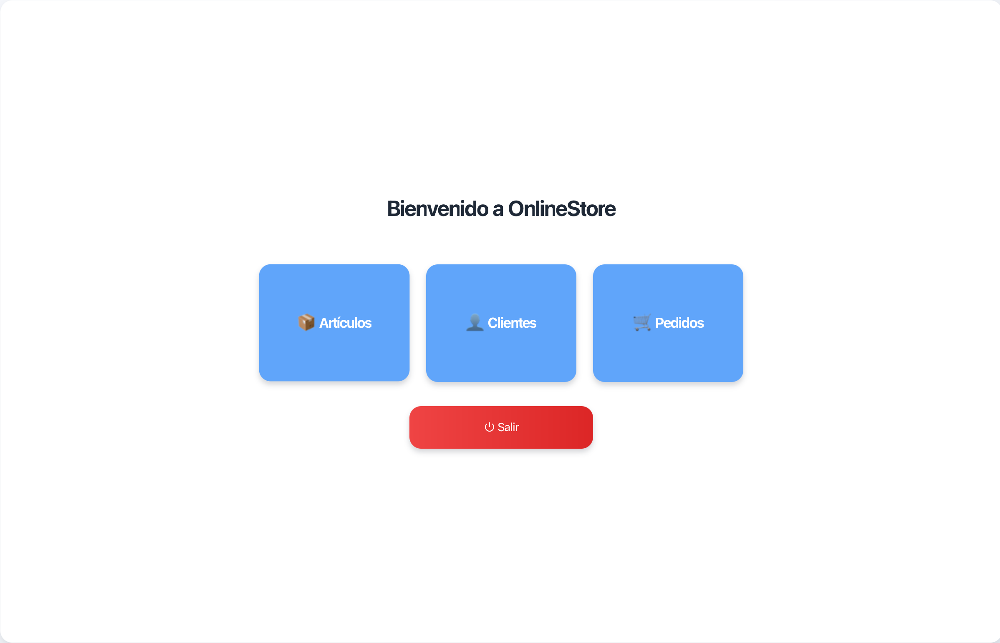

# OnlineStore

  

OnlineStore is a desktop application that simulates the management of an online store.  
It provides tools for managing customers, products, and orders through a graphical interface built with JavaFX.

This repository is presented as a **professional portfolio project** developed by the **OjoAlDato** team.

---

## Documentation

Extended documentation is available in both languages:

- 🇬🇧 [**English documentation**](README_en.md)

- 🇪🇸 [**Documentación en español**](README_es.md)  

---

## Dependencies & Requirements

Technical requirements and external libraries are documented separately:

- 🇬🇧 [**Dependencies (English)**](DEPENDENCIES.md)

- 🇪🇸 [**Dependencias (Español)**](DEPENDENCIAS.md)

---

## Technologies

- Java (JDK 17+)
- JavaFX
- Hibernate (JPA)
- MySQL
- MVC architecture
- DAO pattern

---

## Team

This project was developed by the **OjoAlDato** team:

- **Andrea Ros**  
  [GitHub](https://github.com/androsrivas)  
  [LinkedIn](https://www.linkedin.com/in/androsrivas/)

- **Helena Vivas**  
  [GitHub](https://github.com/helenavivas)  
  [LinkedIn](https://www.linkedin.com/in/helenavivas/)

- **Marcos Llimera**  
  [GitHub](https://github.com/MarcodigoDev)  
  [LinkedIn](https://www.linkedin.com/in/marcos-llimera-aparisi-024779298/)

- **Raul Estevez**  
  [GitHub](https://github.com/RaulEstevezA)  
  [LinkedIn](https://www.linkedin.com/in/raulesteveza/)

---

## License

This project is licensed under the Creative Commons Attribution-NonCommercial-NoDerivatives 4.0 International License.
See the [LICENSE](LICENSE) file for details.

## Notes

- The database service (MySQL) must be running before launching the application.
- The project includes SQL scripts for database creation, test data, and stored procedures.
- This README provides a high-level overview of the project.
- Detailed explanations, screenshots, setup steps, and workflows are available in the extended documentation.

