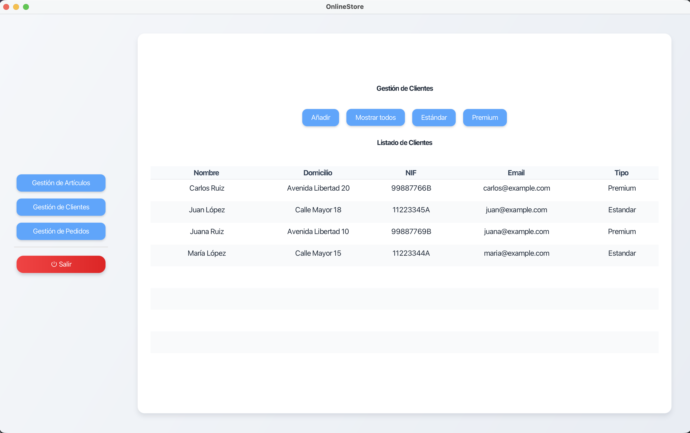
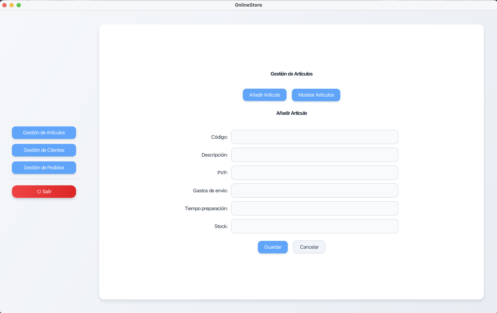
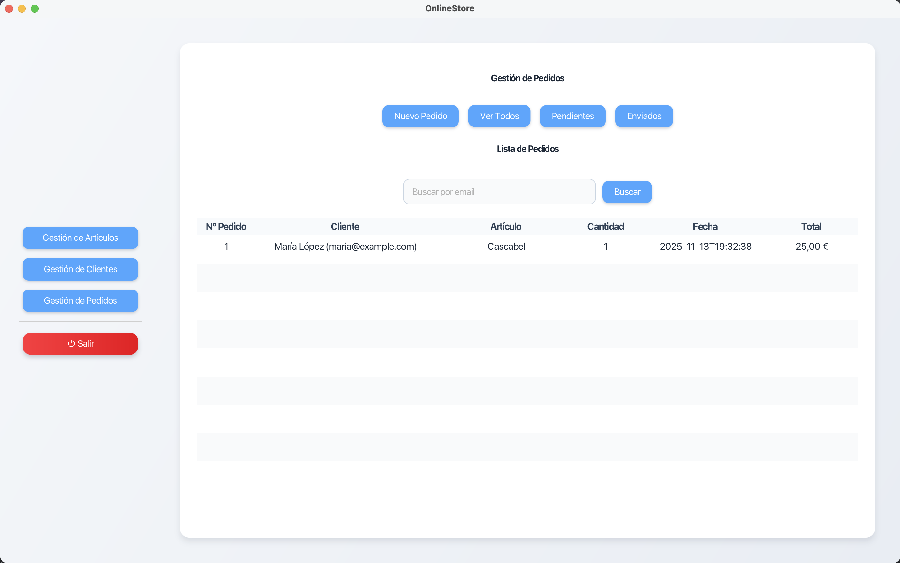
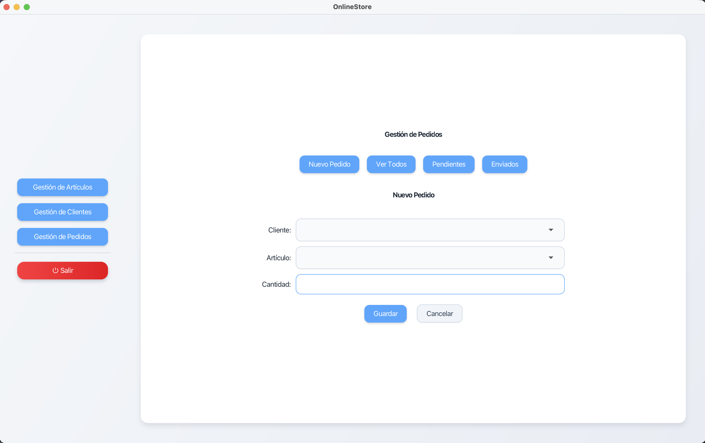

# OnlineStore — Project Documentation

## 1. Introduction

**OnlineStore** is a desktop application developed in Java that simulates the operation of an online store, allowing the management of customers, products, and orders.

The project was developed by the **OjoAlDato** team and is focused on applying good programming practices and building a solid foundation on which a real-world project could be developed, using design patterns and technologies widely adopted in the industry.

---

## 2. General Application Overview

The application allows:

- Customer management (creation, consultation, and classification)
- Product and stock management
- Order management (creation, consultation, cancellation)
- Data persistence using a MySQL database
- Desktop graphical user interface built with JavaFX
- Alternative execution in console mode

The system is structured following the **MVC (Model–View–Controller)** pattern, clearly separating business logic, data persistence, and presentation layers.

---

## 3. Technologies Used

The main technologies used in the development are:

- Java (JDK 17+)
- JavaFX (graphical user interface)
- MySQL (database)
- Hibernate / JPA (ORM)
- JDBC
- JUnit (unit testing)
- Git / GitHub (version control)

The complete list of dependencies can be found in the  
[`DEPENDENCIES.md`](./DEPENDENCIES.md) file.

---

## 4. Project Evolution

The development of the application was carried out in an **iterative** manner, following a progressive improvement process divided into several phases.

Each phase involved extending or improving the system, allowing:

- Definition and consolidation of the domain model
- Implementation of data persistence
- Addition of business logic and controllers
- Integration of a graphical user interface
- Refinement of user experience and code structure

This approach allowed the application to evolve from an initial functional version into a complete and maintainable solution, with a clear and easily extensible architecture.

---

## 5. Main Development Phases

### Phase 1 — UML Design

- Use case diagrams
- Class diagrams
- Definition of system behavior
- Static model design

### Phase 2 — Java Implementation

- Implementation of the class model
- Use of dynamic data structures
- Application of the MVC pattern
- Unit testing with JUnit
- Version control using Git

### Phase 3 — Database Persistence

- Implementation of the DAO pattern
- Use of the Factory pattern
- Data access via JDBC
- Separation of persistence logic

### Phase 4 — ORM-Based Persistence

- Hibernate integration
- Entity mapping using JPA
- Preservation of the MVC pattern
- Simplification of data access

### Phase 5 — Desktop Graphical Interface

- Development of the interface using JavaFX
- View navigation
- Forms, tables, and validations
- Coexistence of graphical interface and console mode

---

## 6. Database

The project uses **MySQL** as the database management system.

The `resources/sql` directory contains the following scripts:

- `crear_tablas.sql`  
  Script for creating all required tables.

- `data.sql`  
  Insertion of sample data for testing purposes.

- `procedimientos_almacenados.sql`  
  Contains stored procedures, such as secure product stock updates, preventing negative values and validating product existence.

These scripts allow the complete database environment to be reproduced in a controlled manner.

⚠️ The database must be created and the MySQL service must be running before launching the application.

---

## 7. Database Configuration

The project includes an example configuration file:
```
db.properties.example
```

This file must be renamed to:
```
db.properties
```

and configured with the correct MySQL credentials before running the application.

---

## 8. Graphical Interface

The application includes a desktop graphical interface developed with **JavaFX**, allowing intuitive and visual store management while keeping business logic decoupled through the MVC pattern.

---

### Main Menu

<p align="center">
  
</p>

---

### Customer Management

<p align="center">
  
</p>

---

### Add Product

<p align="center">
  
</p>

---

### Order Management

<p align="center">
  
</p>

---

### New Order

<p align="center">
  
</p>

---

## 9. License

The project includes a [`LICENSE`](./LICENSE) file that defines the terms of use and distribution of the source code.

---

## 10. Project Status

The project is **functional and stable**, with all core features fully implemented.

It can serve as:
- An advanced academic project
- A base for future extensions
- An example of a Java application using MVC architecture and persistence

---

## Back to main README

[Back to the main project README](README.md)